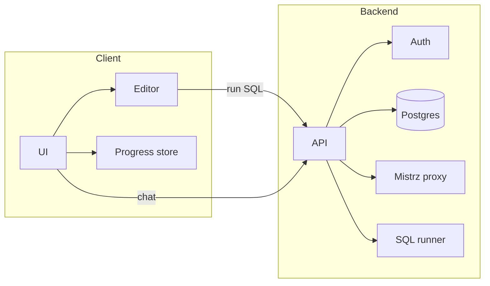

# Agatas SQL Cech – Technical Specification

This document implements the [product vision](.cursor/PRODUCT_VISION.md) and defines stack, architecture, data models, APIs, SQL execution, Mistrz integration, progress persistence, and security. It is the single source of truth for implementation.

---

## 1. Scope

- **In scope:** Stack choices, system boundaries, content and progress data models, API contracts, SQL execution and sandbox rules, LLM (Mistrz) integration, progress persistence in Postgres, authentication (student and teacher), teacher view of student progress, security and configuration.
- **Out of scope:** Detailed UI wireframes; those follow the product vision. Stack may be TBD with options until decided.

---

## 2. Stack

| Layer | Status | Options / choice |
|-------|--------|-------------------|
| **Frontend** | Decided | **SPA.** Component-based UI and client-side routing (e.g. React + Vite). Single HTML entry; all navigation and zadanie flow handled in the client; backend provides API only. |
| **Backend** | Decided | **Node.** Serves API (auth, progress, Mistrz proxy, SQL execution). Stateless; config via env. |
| **App database** | Decided | **Postgres.** Stores users (students, teachers), sessions, and all progress (completed zadania, XP, stopień, streak, achievements). Results and progress are independent of browser and device; user authenticates and data is loaded from Postgres. |
| **Practice DB** | Decided | **Server-side only.** Sandbox = **SQLite** on the backend (one DB or copy per zadanie/session so queries are isolated). Frontend sends query to API; backend executes in SQLite sandbox and returns result or error. **Accounts and progress** persist only in **Postgres** (app database). |
| **LLM (Mistrz)** | Decided | OpenAI API (or compatible); **SSE** for streaming. API key and prompts on backend only. |
| **i18n** | Decided | **i18next** (use **react-i18next** when frontend is React). Locales: `pl` (default), `en`. All visible content and Mistrz replies follow the active locale. See §11. |

When stack is decided, update this section and [agatas-dojo-conventions](.cursor/skills/agatas-dojo-conventions/SKILL.md).

---

## 3. Architecture

- **Client:** SPA. User logs in as student or teacher. Renders zadania, editor, result panel, Mistrz chat, progress UI; teacher view shows student progress. Sends: auth (login/session), run SQL (if server runs it), chat messages, progress updates. No dependency on localStorage for progress; all progress is loaded from and saved to the backend.
- **Backend:** Required. Handles auth (student + teacher login, session), progress (get/update in Postgres), Mistrz proxy, and **SQL execution** (practice DB runs on server). Stateless endpoints; config via env.
- **SQL execution:** Server-side only. Backend runs learner queries in a **SQLite** sandbox per zadanie/session. See §6. Completion results are always persisted to Postgres (app database).
- **Progress:** Stored in Postgres only. Tied to authenticated student. Same progress on any device once the student logs in.

---

## 4. Data models

**Content (static; versioned with app or CMS):**

- **Content theme (practice DB):** **Polonia** is the first theme (Polish community in America). **Multi-theme:** Three themes supported—Polonia, **Wizards school**, **Two young boys and their St Bernard**—with **shared XP and level** across themes (see §12). Each theme has its own zadania (schema, seed, copy), rank labels, and tutor name; experience bar and level are global.
- **Zadanie:** `id`, `theme` (polonia | wizards | urban_mom), `title`, `goal`, `concept` (e.g. "SELECT"), `stopien` (uczen | czeladnik | mistrz), `schema_ddl`, `seed_sql` (or seed data), `expected_result` (row set or value for auto-check), `version`. Order implied by curriculum (see sql-teaching-progression skill). Schema and seed data are theme-specific (Polonia: events, members, attendance, donations; Wizards: spells, levels, orders; Urban mom: household, career, calendar).

**Users and auth:**

- **User:** `id`, `email`, password hash, `role` (student | teacher). **Login:** email + password. **One teacher, many students:** Students have `teacher_id` (FK to teacher) so the teacher sees only their students; single-teacher model.
- **Session:** **JWT** after login. Frontend sends token (e.g. `Authorization: Bearer <token>`); progress and teacher view scoped to the authenticated user.

**Progress (per student; stored in Postgres):**

- **Progress row per student:** `student_id`, `completed_zadania` (set or table of zadanie_id), `current_stopien` (or level), `xp`, `streak_days`, `last_activity_date`, `achievements` (array or table), optional `preferred_theme`. First completion per zadanie_id grants XP; idempotent. **XP and level are shared across all themes:** one experience bar, one level; if you are level 10 in one theme, you are level 10 in every theme. The experience bar shows **persistent growth across themes**.
- **Streak:** **Eastern (America/New_York).** "Day" = calendar day in Eastern; increment streak on consecutive days; reset when a day is missed. Store `last_activity_date` and `streak_days` in Postgres.

Content and progress are separate so progress remains valid when zadania content or order change (e.g. via version or id).

---

## 5. APIs

All responses use a consistent shape. Errors: `{ "error": true, "code": string, "message": string }`.

| Endpoint / contract | Input | Output | Notes |
|---------------------|--------|--------|-------|
| **Auth login** | `email`, `password`, `role` (student \| teacher) | JWT + user info | Backend validates; returns JWT. |
| **Auth me** | Session token | Current user (id, role, optional link to teacher/students) | Scope progress and teacher view. |
| **Run SQL** | `zadanie_id`, `query` (auth: student) | `{ rows?, columns?, error? }` or DB error message | Sandbox only; see §6. |
| **Mistrz chat** | `message`, `context`: { zadanie_id, schema, last_query, db_response, attempt_count } | Streamed reply (SSE) | Backend proxies LLM. |
| **Progress get** | Auth (student) | `{ completed_zadania, current_stopien, xp, streak, achievements }` | From Postgres. |
| **Progress update** | Auth (student), completion: `zadanie_id`, optional streak/achievement payload | Idempotent; return updated progress | Persisted to Postgres. |
| **Teacher: student progress** | Auth (teacher), `student_id` (or list) | Progress per student | Only students linked to teacher. |
| **List zadania** | Optional filter: `theme`, `stopien`, or “unlocked” given progress | `[ { id, theme, title, goal, stopien, completed? } ]` | Unlock by previous completion or stopień; with multi-theme, filter by user theme. |

Backend is required. All progress is stored in Postgres and scoped to the authenticated user. **XP and level are global** (shared across themes); see §12.

---

## 6. SQL execution

- **Sandbox:** Learner runs only against a copy of the zadanie seed DB or a read-only view. No writes to shared or real data.
- **Success check:** Compare expected vs actual result in a way that **maximizes learner engagement**: e.g. order-insensitive row set match, or row count + content match, so correct answers are not rejected for minor differences (e.g. row order). Avoid strict ordering unless required by the zadanie goal.
- **No concatenation:** User input (query) is never concatenated into SQL. Execute the learner’s query as-is in the sandbox (one statement or whitelisted set). Validate/sanitize for safety (e.g. no multiple statements if engine allows; no destructive DDL if not part of curriculum).
- **Engine and location:** Server only. **SQLite** for the sandbox; one DB or copy per zadanie/session/request so learner queries are isolated. Frontend calls Run SQL API; backend executes and returns rows or error. App data (users, progress) stays in Postgres only.
- **Errors:** Map common DB errors to learner-facing messages (e.g. “column X does not exist” → “Sprawdź schemat – ta kolumna może mieć inną nazwę.”). Pass through to Mistrz only when needed for richer hint.

---

## 7. Mistrz (LLM) integration

- **Context payload:** Current zadanie (id, goal, concept), schema (DDL or short description), learner’s last query, DB response (error text or row count/sample), attempt count for this zadanie.
- **System prompt:** Role = Socratic tutor; language = Polish; hints first, full solution only when stuck or asked (“pokaż odpowiedź”). See [llm-tutor-chat](.cursor/skills/llm-tutor-chat/SKILL.md).
- **Streaming:** **SSE** for reply chunks. Backend holds API key and prompt; frontend never sees key.
- **Location:** Backend route (e.g. POST /api/mistrz or /api/v1/chat) that calls LLM and streams response.

---

## 8. Progress persistence

- **Where:** Postgres only. Progress is tied to the authenticated student; the same progress on any device after login. No dependency on browser localStorage or device.
- **Shared XP and level across themes:** One XP total and one level (or stopień tier) per student. The **experience bar shows persistent growth across themes**—if you are level 10 in Polonia, you are level 10 in Wizards and Urban mom; switching theme does not reset or split progress. Rank *labels* (e.g. "Czeladnik" vs "Adept") are theme-specific; the underlying level/XP is global.
- **Idempotency:** First completion of a zadanie_id grants XP and counts for unlock; repeat completions do not double XP. Store completed set (or rows) by student_id and zadanie_id.
- **Streak:** “Day” = calendar day in **Eastern (America/New_York)**. Increment streak when activity on consecutive days; reset when a day is missed. Store `last_activity_date` and `streak_days`. “Streak at risk” = no activity today (in Eastern).
- **Versioning:** Content (zadanie) may gain a `version`; progress references zadanie_id. If a zadanie is removed or re-id’d, define policy (e.g. completed IDs still count; new IDs for new content).

---

## 9. Security

- **Secrets:** No API keys or secrets in frontend. LLM and any paid/external services called from backend only. Passwords hashed (e.g. bcrypt); never store plain text.
- **SQL:** Parameterized or controlled execution path only; never build SQL from user input. Sandbox limits blast radius.
- **Input validation:** Validate zadanie_id, query length, and message length before execution or forwarding to Mistrz.
- **Auth/session:** Required. **Student login** and **teacher login** with **email + password**; **JWT** after successful auth. All progress and teacher-view endpoints require an authenticated user. Teacher can access only their linked students’ progress (one teacher, many students; students have teacher_id).

---

## 10. Configuration and deployment

- **Env vars:** LLM API base URL and key (backend); optional feature flags (e.g. enable Mistrz, enable streaks). Frontend has no secrets.
- **Deployment:** **AWS EC2 Ubuntu.** App (SPA + Node API) runs in a **Docker** container; deploy to EC2 Ubuntu server. Postgres on same host or RDS. Logging and error handling from day one; structured errors for debugging.

---

## 11. Language / locale (i18n)

- **Framework:** i18next. If the frontend is React, use react-i18next for integration.
- **Locales:** `pl` (Polish, default) and `en` (English). One active locale for the entire app at a time.
- **Switch:** Flag control in the UI: US flag sets locale to `en`, Polish flag sets locale to `pl`. Persist choice (e.g. `localStorage` key `cech_locale` or i18next’s persistence layer) so it survives refresh.
- **Scope:** All UI strings, feedback messages, navigation labels, and (optionally) zadanie title/goal. Store translations in namespace(s) or JSON files per locale (e.g. `locales/pl.json`, `locales/en.json`). Use translation keys in code; no hardcoded user-facing strings.
- **Mistrz:** Frontend sends current `locale` (e.g. `pl` or `en`) with each chat request; backend system prompt instructs the LLM to respond in that language so Mistrz replies match the rest of the site.
- **Default:** If no stored locale, default to `pl`. Optionally detect browser language and default to `pl` when the browser is Polish, else `en`.

---

## 12. Multi-theme (Polonia, Wizards school, Two young boys and their St Bernard)

- **Themes:** Three content themes. **(1) Polonia** – Polish community in America; events, members, attendance, donations, clubs; tone: belonging and heroic professional. **(2) Wizards school** – learning spells, leveling up; orders of magical skill (rank labels e.g. Apprentice → Adept → Master); tutor e.g. "Professor" or "Archmage." **(3) Two young boys and their St Bernard** – family and pet adventures; tasks, outings, dog care; rank labels and tutor name to match (e.g. "Coach" or "Captain").
- **Theme selection:** User has a preferred or current theme (e.g. `preferred_theme` on user or progress); UI shows zadania and labels for that theme. User can switch theme; same XP and level apply.
- **Content per theme:** Each theme has its own set of zadania (same SQL concepts, different schema, seed data, and copy). Zadanie has `theme` (polonia | wizards | urban_mom). List zadania filtered by theme.
- **Rank labels and tutor:** Stored as theme config (e.g. Polonia: Uczeń/Czeladnik/Mistrz, Mistrz; Wizards: Apprentice/Adept/Master, Professor; Urban mom: TBD). Progress stores a single `current_stopien` or level number; UI maps that to the active theme’s label. Tutor name (Mistrz vs Professor vs Mentor) and optional LLM system-prompt slice are per-theme.
- **Experience bar and level:** **Persistent across themes.** One XP pool and one level per student. The experience bar always reflects total progress; switching theme does not reset or split it. If you are level 10 in one theme, you are level 10 in all themes. Implement so the progress API returns a single `xp` and level/tier; frontend displays the experience bar from that global state and applies the current theme’s rank label for display only.
